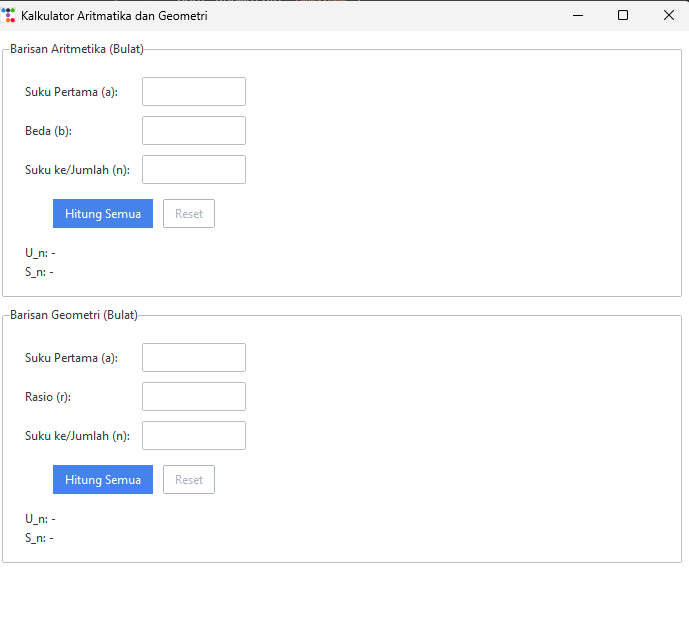

# Kalkulator Barisan Aritmatika dan Geometri

Aplikasi desktop sederhana yang dibangun menggunakan Python, Tkinter, dan pustaka `ttkbootstrap` untuk penataan gaya. Kalkulator ini membantu pengguna menemukan suku ke-n (U_n) dan jumlah n suku pertama (S_n) untuk barisan aritmatika maupun geometri. Perhitungan dilakukan menggunakan input bilangan bulat.

## Fitur

*   **Perhitungan Barisan Aritmatika:**
    *   Input: Suku pertama (a), beda (b), dan suku ke/jumlah suku (n).
    *   Output: Suku ke-n (U_n) dan jumlah n suku pertama (S_n).
*   **Perhitungan Barisan Geometri:**
    *   Input: Suku pertama (a), rasio (r), dan suku ke/jumlah suku (n).
    *   Output: Suku ke-n (U_n) dan jumlah n suku pertama (S_n).
*   **Validasi Input:**
    *   Memastikan semua input (a, b, r, n) adalah bilangan bulat.
    *   Memastikan semua input adalah bilangan bulat positif (karena logika validasi saat ini `nilai <= 0`).
    *   Menampilkan pesan kesalahan untuk input yang tidak valid.
*   **Penanganan Kesalahan:**
    *   Menangani potensi `OverflowError` untuk hasil yang sangat besar pada perhitungan geometri.
    *   Menangani `ZeroDivisionError` jika rasio (r) adalah 1 dalam rumus S_n standar untuk deret geometri (kasus khusus untuk r=1 sudah diimplementasikan).
    *   Menangani `TypeError` jika input tidak sesuai untuk operasi pangkat.
*   **Fungsionalitas Reset:** Memungkinkan pengguna untuk menghapus kolom input dan hasil untuk bagian aritmatika dan geometri.
*   **Antarmuka Pengguna:**
    *   UI yang bersih dan modern dengan gaya dari `ttkbootstrap` (tema litera).
    *   Frame terpisah untuk perhitungan aritmatika dan geometri.

## Cuplikan Layar (Screenshot)


(./Assets/Demo.mp4)

**Contoh Tampilan:**
| Kalkulator Aritmatika dan Geometri |
| [Barisan Aritmetika (Bulat)] |
| Suku Pertama (a): [ input_a_arit ] |
| Beda (b): [ input_b_arit ] |
| Suku ke/Jumlah (n): [ input_n_arit ] |
| [Hitung Semua] [Reset] |
| U_n: - |
| S_n: - |
| |
| [Barisan Geometri (Bulat)] |
| Suku Pertama (a): [ input_a_geom ] |
| Rasio (r): [ input_r_geom ] |
| Suku ke/Jumlah (n): [ input_n_geom ] |
| [Hitung Semua] [Reset] |
| U_n: - |
| S_n: - |

## Instalasi

1.  **Kloning repositori (atau unduh skrip):**
    Jika ini berada di repositori Git:
    ```bash
    git clone <url-repositori>
    cd <nama-repositori>
    ```
    Jika tidak, cukup simpan skrip Python (misalnya, sebagai `kalkulator_barisan.py`) di sebuah direktori.

2.  **Instal dependensi:**
    Pastikan Anda memiliki file `requirements.txt`
    Kemudian jalankan:
    ```bash
    pip install -r requirements.txt
    ```
